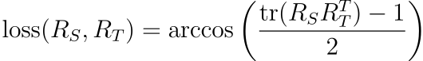

# PyTorch Geodesic Loss

A PyTorch criterion for computing the distance between rotation matrices (as described [here](http://www.boris-belousov.net/2016/12/01/quat-dist/#using-rotation-matrices) and [here](https://link.springer.com/article/10.1007/s10851-009-0161-2)).
Specifically, the loss is calculated as:

<p align="center">
  
</p>


```python
import torch

from geodesic_loss import GeodesicLoss
from scipy.spatial.transform import Rotation

N = 100
Rs = torch.Tensor(Rotation.random(2 * N).as_matrix())
R_Ss = Rs[:N]
R_Ts = Rs[N:]

criterion = GeodesicLoss(reduction="none")
dists = criterion(R_Ss, R_Ts)
```
